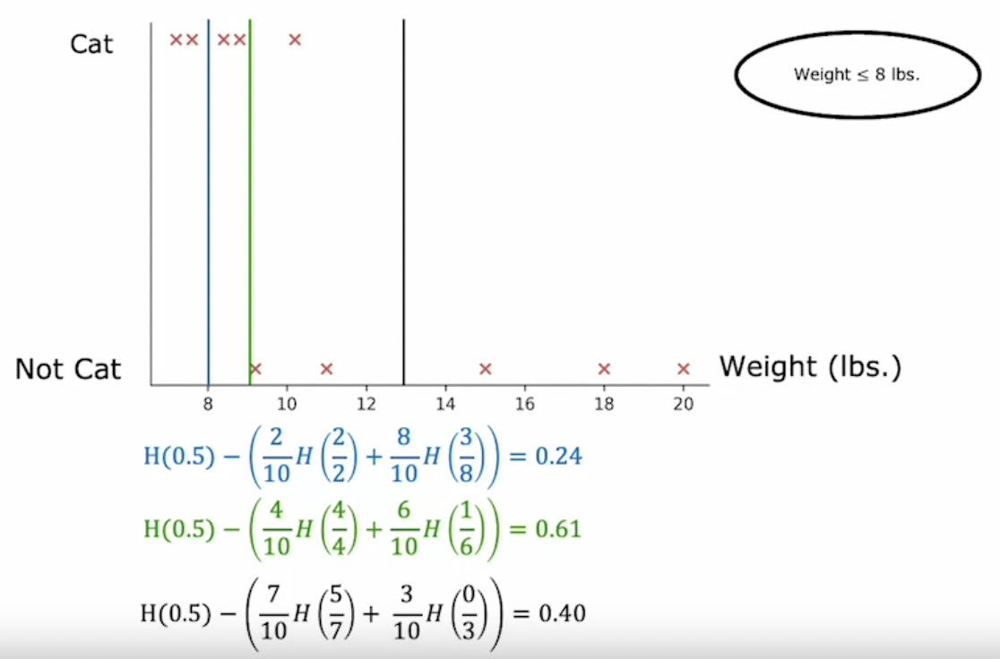

# Decision Tree Learning

## Measuring Purity

- *Entropy* is the measure of impurity in a decision tree.
- To refresh, purity refers to the homogeneity of data - if all our data on a node is of the same class, then there is a high level of purity. In contrast, if there is a mix of different classes, there is a low level of purity.
- Let $p_1$ refer to the fraction of correctly classified labels on a node. The entropy of that node is then $H(p_1)$.

### Entropy Formula

- $p_1$ - The fraction of correctly classified labels on a node.

    $p_0 = 1 - p_1$

- $H(p_1)$ - Entropy function measuring purity of a node.

    $H(p_1) = -p_1 \log_{2}(p_1) - p_0 \log_{2}(p_0)$\
    $H(p_1) = -p_1 \log_{2}(p_1) - (1 - p_1) \log_{2}(1 - p_1)$

### Entropy Intuition

- The graph of $H(p_1)$ looks like an upside-down smiley face.
- Therefore, as $p_1$ approaches either end (i.e. as labels become homogenous), entropy is small.
- Conversely, when $p_1 = 0.5$, the classes of labels are evenly mixed and entropy is at its highest.

## Choosing a Split - Information Gain

- **Information Gain**: Refers to the reduction in entropy from making a split. Thus, we choose the split which gives us the highest information gain.
- When choosing which feature to split our data on, we combine the entropy values on the left and right sub-trees by taking a *weighted average*. This is because the importance of the our entropy value depends on the number of labels there are.
- In addition, we compute the *reduction in entropy*, by subtracting our weighted-average calculation from the initial entropy at our root node. This calculation gives us the *information gain*.
- Information gain is also useful number that can serve as a threshold to tell us when to stop splitting the tree.

### Information Gain Formula

- $p_1^{left}$ - Fraction of positive labels on the left sub-tree.
- $w^{left}$ - Fraction of all examples that went to the left sub-tree.
- $p_1^{right}$ - Fraction of positive labels on the right sub-tree.
- $w^{right}$ - Fraction of all examples that went to the right sub-tree.
- $p_1^{root}$ - Fraction of all positive examples in the root node.
- $H(p_1^{root})$ - Entropy of root node.
- $w^{left}H(p_1^{left}) + w^{right}H({p_1^{right}})$ - Weighted average of entropy on the left and right sub-trees.
- Information Gain:

    $H(p_1^{root}) - (w^{left}H(p_1^{left}) + w^{right}H({p_1^{right}}))$

## Continuous Valued Features

- Some features can be a continuous range of numbers (e.g. height, weight) which make it difficult to split on because we don’t have clear categories.
- In such cases, we can try a threshold to split the data on, and calculate the information gain from that split.
- We can then try all possible splits, and take the one which gives us the highest information gain.

## Regression Trees

- We can generalize decision trees to predict for regression problems, i.e. a continuous range of values (e.g. height, weight, price, etc.)
- Instead of calculating entropy and information gain, we decide on how we split the tree by calculating the loss in variance.
- We calculate the sum of the weighted variance of the left and right sub-trees. Then, we can calculate the loss in variance from the root node, and split on the feature which gives the greatest loss.

    $V(root) - (w^{left} V(left) + w^{right} V(right))$

### Variance

- **Variance**: Average of the of standard deviations (i.e. squared differences from the mean).

    $s^2 = \frac{\sum^{n}_{i = 1} (x - \bar{x})^2}{n - 1}$
