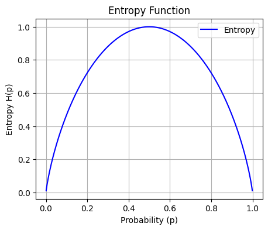

# Decision Tree Purity

## Measuring Purity

- *Entropy* is the measure of impurity in a decision tree.
- To refresh, purity refers to the homogeneity of data - if all our data on a node is of the same class, then there is a high level of purity. In contrast, if there is a mix of different classes, there is a low level of purity.
- Let $p_1$ refer to the fraction of correctly classified labels on a node. The entropy of that node is then $H(p_1)$.

### Entropy Formula

- $p_1$ - The fraction of correctly classified labels on a node.

    $p_0 = 1 - p_1$

- $H(p_1)$ - Entropy function measuring purity of a node.

    $H(p_1) = -p_1 \log_{2}(p_1) - p_0 \log_{2}(p_0)$\
    $H(p_1) = -p_1 \log_{2}(p_1) - (1 - p_1) \log_{2}(1 - p_1)$

### Intuition

- The graph of $H(p_1)$ looks like an upside-down smiley face.
- Therefore, as $p_1$ approaches either end (i.e. as labels become homogenous), entropy is small.
- Conversely, when $p_1 = 0.5$, the classes of labels are evenly mixed and entropy is at its highest.

