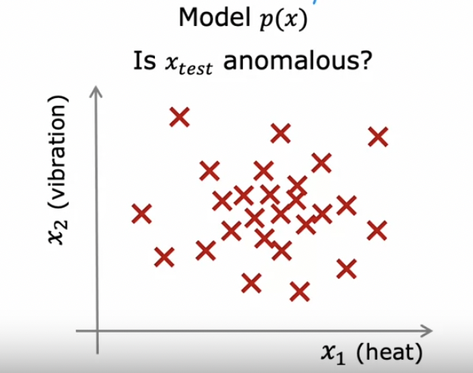
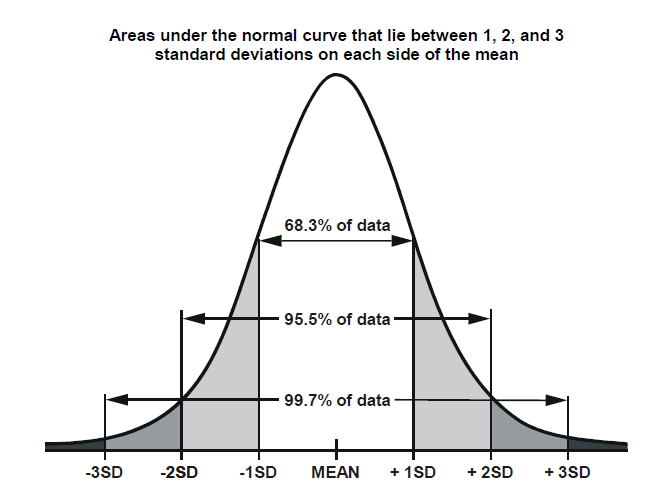

# Anomaly Detection

## Finding Unusual Events

- Given a dataset $\{ x^{(1)}, x^{(2)}, ..., x^{(m)} \}$, where $x^{(m)}$ is the $m^{th}$ training example, we want to determine if a new example $x_{test}$ is anomalous.

### Density Estimation

- We can determine if a new example is anomalous by building a model for the probability of $x$, $p(x)$. In other words, how likely is $x$?
- If $p(x_{test}) < \epsilon$, then $x_{test}$ is anomalous.

    

## Gaussian (Normal) Distribution

- In a Gaussian / normal distribution, the probability of $x$ is determined along the bell-shaped curve with mean $\mu$ and variance $\sigma^2$.

    

- The formula for probability in a normal distribution:

    $p(x) = \frac{1}{\sqrt{2\pi} \sigma} e^{\frac{-(x - \mu^2)}{2\sigma^2}}$

- In anomaly detection, we can find the mean, $\mu$ by taking the average of all the training examples:

    $\mu = \frac{1}{m} \sum^{m}_{i = 1} x^{(i)}$

- And we can find the variance by finding the average of the squared distance between the mean and all training examples:

    $\sigma^2 = \frac{1}{m} \sum^{m}_{i = 1} (x^{(i)} - \mu)^2$

## Anomaly Detection Algorithm

- Given that each example in our training set $\vec{x^{(i)}}$ has $n$ features, the probability of $\vec{x}$ is the multiplication of the probabilities of all its features.

    $p(\vec{x}) = p(x_1;\mu_1, \sigma^2_1) * ... * p(x_n;\mu_n, \sigma^2_n)$\
    $p(\vec{x}) = \prod^{n}_{j = 1} p(x_j;\mu_j, \sigma^2_j)$

- To summarize, we first choose $n$ features which may be indicative of an anomaly. Afterwards, we fit parameters by calculating the mean, $\mu$ and variance, $\sigma^2$. Using these values, we compute our model $p(x)$, which we can then use to predict that a new example is anomalous if it falls below a threshold, $p(x_{test}) < \epsilon$.

## Developing & Evaluating an Anomaly Detection System

- Given a dataset with 2-50 anomalies and many non-anomalous examples, create a training set consisting purely of non-anomalous examples, and split the anomalies into the cross-validation and test sets.
- After training your model on the train set, tune epsilon, $\epsilon$ on the cross-validation set.
- Finally, evaluate the model on the training set.

$$
y=\left\{
\begin{aligned}
& 1, \text{ if } p(x) < \epsilon \\
& 0, \text{ if } p(x) \ge \epsilon \\
\end{aligned}
\right.
$$

- Because our dataset will be very skewed, we may consider using precision / recall / $F_1$-score to evaluate our model.
