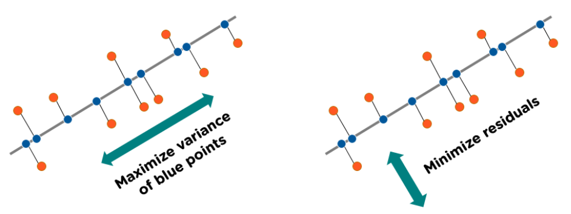

# Principle Component Analysis (PCA)

## Reducing the Number of Features

- Principle component analysis (PCA) is a technique used to visualize datasets with many features. It does so by reducing the total number of features to two or three while maintaining the overall meaning.
- Given features $x_1$ and $x_2$, if $x_2$ doesn’t vary a lot, PCA may decide to just keep $x_1$.
- If $x_1$ and $x_2$ both contain useful information, PCA will combine them into a new axis.

## PCA Algorithm

- Before applying PCA, it is important to normalize the features of the dataset such that the mean, $\mu = 0$. This is because we don't want our features to have very different scales.
- Given $x_1$ and $x_2$, the *principle component* is the axis along which we can compress our data that gives us the maximum variance/spread. This means minimizing the perpendicular distance between each point and the new axis.
- Our new axis is denoted a new length 1 vector. To project our previous points on the new axis, we take the dot product between the old point and the resulting vector.
- Given our new axis constructed by PCA, we *reconstruct* (estimate) the coordinates of our original point. If our new point is $z$, to find our original points ($x_1$, $x_2$), multiply $z$ by our axis unit vector.

    

## PCA in Code

```python
# Fit PCA to 1 principle component.
pca_1 = PCA(n_components=1)

# Get the reduced dataset.
X_trans_1 = pca_1.fit_transform(X)

# Describes the level of information / variance captured.
pca_1.explained_variance_ratio_

# Reconstruction - estimate back original data.
X_reduced_1 = pca.inverse_transform(X_trans_1)
```
